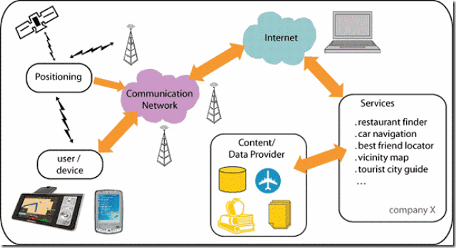

# Tranining_Location

##. I.

Không có key ko hiện lên dk map

## II. Location-Based Service (Dịch vụ dựa trên vị trí)

### 1. Khái niệm

Dịch vụ dựa trên vị trí (LBS) là các dịch vụ được cung cấp qua thiết bị di động dựa vào vị trí của thiết bị. Một số ứng dụng LBS phổ biến như: thông tin địa phương, chỉ đường, địa điểm ưu thích, quản lý giám sát vị trí phương tiện,…

Định vị LBS giúp cho người sử dụng xác định được vị trí của đối tượng trên bản đồ số thông qua các phần mềm cài đặt trong smart phone, máy vi tính hay bản đồ trên website. Người sử dụng có thể nhận được các kết quả phân tích thông qua những dữ liệu nhận được từ tín hiệu định vị LBS.

LBS hoạt động dựa trên sự kết hợp của nhiều công nghệ: Internet –  Hệ thống thông tin địa lý (Geographic Information System) – Thiết bị di động (Mobile devices)

Phương thức hoạt động của LBS

Dựa vào vị trí và các yêu cầu của thiết bị, thông qua mạng Internet, nhà cung cấp gửi thông tin đến thiết bị của người dùng.



Android cung cấp cho ứng dụng của bạn quyền truy cập vào các dịch vụ định vị được thiết bị hỗ trợ thông qua các lớp trong package android.location. Thành phần trung tâm của framework vị trí là lớp LocationManager, nơi cung cấp APIs để xác định vị trí, chứa nhiều phương thức liên quan


### 2. Class xử lý trong Android 

- **Location**: đại diện cho 1 vị trí địa lý bao gồm vĩ độ, kinh độ, nhãn thời gian(cả thời gian UTC và thời gian thực trôi qua từ khi khởi động), và có thể các thông tin khác như độ cao, tốc độ, ...

- **LocationManager**: cung cấp quyền truy cập vào các dịch vụ định vị vị trí. Các service này cho phép các ứng dụng có được các bản cập nhật định kỳ về vị trí địa lý của thiết bị hoặc kích hoạt một ứng dụng được chỉ định Intent khi thiết bị đi vào vị trí gần của một vị trí địa lý nhất định. LocationManager là lớp qua đó ta có thể truy cập dịch vụ định vị trên Android. Ta gọi ra bằng gọi **getSystemService()**

```
LocationManagerlocationManager = (LocationManager)getSystemService(Context.LOCATION_SERVICE);

```

- **Location Provider**: nơi cung cấp dữ liệu vị trí trong Android. Có 2 loại chính:

+ GPS Location Provider: cung cấp vị trí với độ chính xác cao nhất (~ 2m - 20m). Dữ liệu được cung cấp qua vệ tinh. Tuy nhiên có 1 số hạn chế:

~ Chậm hơn network provider khi khởi tạo ban đầu. Nhưng khi xong thì dữ liệu cập nhật sẽ tương đối nhanh.

~ Sử dụng sẽ rất tốn pin. Nên tắt khi không sử dụng.

~ Thật ra là GPS sử dụng sóng radio, mà dễ bị cản bởi vật rắn. Do vậy nó sẽ không hoạt động khi bạn ở trong nhà hoặc tầng hầm.

+ Network Provider: sử dụng điểm phát Wifi hoặc cell tower để tính sấp xỉ vị trí. Độ chính xác trong khoảng 100 - 1000m. Độ chính xác của vị trí phụ thuộc vào số lượng điểm phát wifi hoặc cell tower trong khu vực. 

Còn 1 loại nữa là LocationManager.PASSIVE_PROVIDER

Có thể check sự có mặt của provider dùng code sau: 

```
isGpsEnabled = mLocManager.isProviderEnabled(LocationManager.GPS_PROVIDER);

isNetworkEnabled = mLocManager.isProviderEnabled(LocationManager.NETWORK_PROVIDER);
```

- **LocationListener**: lắng nghe sự kiện, thông báo từ LocationManager khi vị trí thay đổi hay LocationProvider bị disable hoặc enable
 Các phương thức: onLocationChanged, onProviderDisabled, onProviderEnabled

### 3. Quyền truy cập + Chọn tiêu chí cho LocationProvider

### a. Quyền truy cập

- ACCESS_FINE_LOCATION: khi location provider là GPS hoặc Network hoặc cả hai

- ACCESS_COARSE_LOCATION: khi location provider Network

### b. Chọn tiêu chí cho LocationProvider

- Sử dụng lớp **Criteria**: giúp lựa chọn độ chính xác, mức độ năng lượng tiêu thụ, check tốc độ, chi phí thêm, ...

```
val criteria = Criteria()
            criteria.setAccuracy(Criteria.ACCURACY_FINE)
            criteria.setPowerRequirement(Criteria.POWER_LOW)
            criteria.setAltitudeRequired(false)
            criteria.setBearingRequired(false)
            criteria.setSpeedRequired(false)
            criteria.setCostAllowed(true)
```

### 4. Code

Dùng xong thì nên unregister listener khỏi location manager. Làm thế sẽ tiết kiệm được pin, nếu ko nó sẽ cố truy cập GPS để lấy thông tin địa chỉ chính xác/chi tiết hơn. Nếu cần thì đăng kí lại rồi hủy đi.


requestLocationUpdates():

- minTime: thời gian nhỏ nhất giữa 2 lần update (milisecond)

- minDistance: khoảng cách gần nhất giữa 2 lần update (meter)

- Criteria: như ở phần 3

- PendingIntent: Location update được nhận bởi LocationListener callback hoặc bởi broadcast intents tới 1 PendingIntent được cung cấp. Nếu được cung cấp thì location upate được gửi với key là KEY_LOCATION_CHANGED và một giá trị Location. ====> Xem tiếp sau


```
This API is not the recommended method for accessing Android location.
The Google Location Services API, part of Google Play services, is the preferred way to add location-awareness to your app. It offers a simpler API, higher accuracy, low-power geofencing, and more. If you are currently using the android.location API, you are strongly encouraged to switch to the Google Location Services API as soon as possible. 

To learn more about the Google Location Services API, see the Location API overview.
```

### IV. Tối ưu hóa pin

### 1. Background Location Limit 

Giới thiệu ở Android 8.0 có 1 số cải tiến về cách location service ảnh hưởng tới pin:

-  Thu thập vị trí ở background bị giới hạn và location được tính, gửi đi chỉ vài lần mỗi giờ.

- Quét bằng Wifi sẽ thận trọng hơn, và update vị trí sẽ không được thực hiện khi thiết bị được giữ kết nối tới cùng 1 điểm truy cập tĩnh

- Geofencing sẽ thay đổi từ chục giây tới sấp xỉ 2 phút, sẽ có thể làm pin tăng hiệu suất tới 10 lần

### 2. Hiểu về tiêu thụ pin

- Độ chính xác: càng cao càng tốn pin.

Bạn có thể chỉnh được độ chính xác của việc xác định vị trí bằng phương thức setPriority() với một số các giá trị sau:

PRIORITY_HIGH_ACCURACY: Cung cấp vị trí chính xác nhất có thể bằng cách sử dụng nhiều đầu vào để xác định vị trí. Nó cho phép GPS, Wi-Fi, mang di động và các cảm biến khác nữa dẫn đến hao tổn pin khá lớn.

PRIORITY_BALANCED_POWER_ACCURACY: Cung cấp vị trí chính xác trong khi tối ưu hóa năng lượng. Rất ít khi sử dụng GPS, thông thường sử dụng Wi-Fi và thông tin di động để xác định vị trí.

PRIORITY_LOW_POWER: Chủ yếu dựa vào các tháp di động và tránh sử dụng GPS và Wi-Fi, cung cấp độ chính xác thô cấp thành phố với độ tiêu hao pin tối thiểu.

PRIORITY_NO_POWER: Nhận vị trí thụ động từ các ứng dụng khác mà vị trí đã được tính toán rồi.
Tùy vào ứng dụng cần độ chính xác như nào thì sẽ cấp cho ứng dụng quyền truy cập tương ứng.

- Tần suất: càng tính toán vị trí nhiều thì pin càng tốn

Có 2 phương thức cho phép bạn thay đổi khoảng thời gian tính toán vị trí:

setInterval(): Để chỉ định khoản thời gian mà vị trí được tính toán cho ứng dụng của bạn.

setFastestInterval(): Để chỉ định khoảng thời gian mà vị trí được tính toán cho các ứng dụng khác được gửi đến ứng dụng của bạn.

Để tránh lãng phí pin thì nên sử dụng khoảng thời gian vài giây để lấy vị trí trong các trường hợp foreground. Còn trong những trường hợp background thì hãy tìm giá trị lớn nhất có thể được. Việc này được Android 8.0 giải quyết nhưng đối với những phiên bản cũ hơn lại là một các tốt.

- Độ trễ: tốc độ mà dữ liệu vị trí được gửi đến, càng thấp càng tốn pin


Có thể điều chỉnh độ trễ bằng phương thức setMaxWaitTime() thường được truyền một giá trị lớn hơn nhiều lần so với khoảng thời gian setInterval(). Cài đặt này giúp cho việc trì hoãn phân phối vị trí và cập nhật vị trí.

Nếu ứng dụng của bạn không ngay lập tức cần cập nhật vị trí thì bạn nên sử dụng giá trị lớn nhất có thể để có thể tiết kiệm pin nhiều nhất.

Khi bạn sử dụng geofences, ứng dụng của bạn nên truyền vào một giá trị lớn vào trong phương thức setNotificationResponsiveness(). Giá trị 5 phút hoặc lớn hơn được đề nghị trong trường hợp này.

### 3. Một số trường hợp

- Bắt đầu cập nhật dựa trên trạng thái của người dùng: Chỉ yêu cầu cập nhật khi người dùng đang lái xe hoặc đang đi xe đạp.

- Biết vị trí của thiết bị: Ví dụ như ứng dụng thời tiết muốn biết vị trí của thiết bị. Vậy nên sử dụng phương thức getLastLocation() để trả về giá trị khả dụng gần đây(hiếm khi trả về null). Sử dụng kết hợp với phương thức isLocationAvailable() trả về giá trị true khi vị trí được trả về một cách hợp lý.


